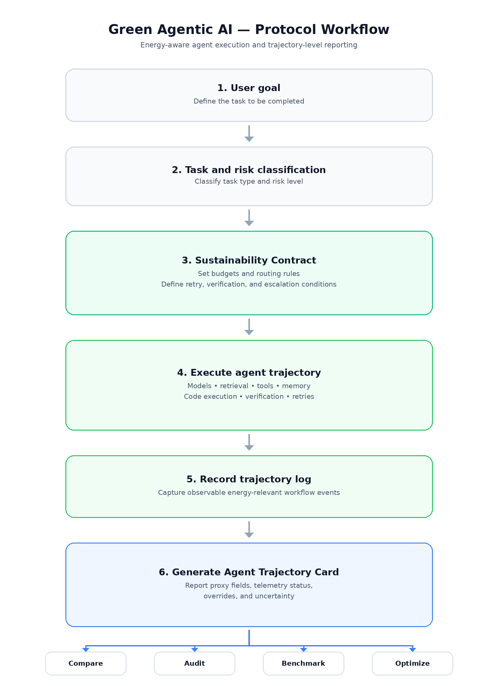

# Green Agentic AI

**Energy-Aware Disclosure Protocol for Sustainable Agentic Workflows**

This repository provides reusable artifacts for trajectory-level energy disclosure in agentic AI systems. The reporting unit is the agent trajectory: the sequence or graph of planning, model calls, retrieval, tools, code execution, verification, retries, memory, escalation, and related operations used to complete a goal.

The repository accompanies the paper **“Green Agentic AI: An Energy-Aware Disclosure Protocol for Sustainable Agentic Workflows.”**

## Start here

| If you want to… | Use |
|---|---|
| understand the protocol | [`PROTOCOL.md`](PROTOCOL.md) |
| create a sustainability contract | [`contracts/sustainability-contract.yaml`](contracts/sustainability-contract.yaml) |
| report a lightweight run | [`cards/minimal-card.yaml`](cards/minimal-card.yaml) |
| create the standard machine-readable card | [`cards/machine-readable-card.yaml`](cards/machine-readable-card.yaml) |
| prepare an audit-grade record | [`cards/audit-grade-card.yaml`](cards/audit-grade-card.yaml) |
| map workflow events to disclosure fields | [`taxonomy/agentic-energy-taxonomy.md`](taxonomy/agentic-energy-taxonomy.md) |
| record trajectory events before summarizing them | [`templates/trajectory-events.csv`](templates/trajectory-events.csv) |
| interpret proxy classes A–E | [`reference/energy-proxy-classes.md`](reference/energy-proxy-classes.md) |
| compare several trajectories | [`templates/trajectory-comparison.csv`](templates/trajectory-comparison.csv) |
| review a card before release | [`CHECKLIST.md`](CHECKLIST.md) |

## How to apply the protocol

  

## Reusable artifacts

### Agentic Energy Taxonomy
The taxonomy names energy-relevant workflow primitives and connects each primitive to a disclosure field. It covers task classification, retrieval, planning, generation, tool execution, code execution, verification, retries, memory access, multi-agent coordination, and human escalation.

### Agentic Sustainability Contract
The contract records task and risk class, model-tier and token budgets, tool/code limits, retrieval and cache rules, retry limits, verification requirements, escalation conditions, and reporting depth.

### Agent Trajectory Card
The card records how an agent completes a goal. The machine-readable form includes model-call count, model tiers, token class, retrieval count, cache status, tool calls, code runs, verification, retries, memory events, latency, energy proxy class, carbon-aware scheduling, safety overrides, telemetry availability, and uncertainty.

## Reporting depths

The paper defines three reporting depths:

- **Minimal** — model-call count, model tiers, token class, tool calls, retries, and energy proxy class.
- **Standard** — adds retrieval/cache use, verification, code execution, memory access, latency, uncertainty, and optimization notes.
- **Audit-grade** — binds the trajectory record to timestamps, configuration, provider, region, telemetry hooks, and policy overrides.

## Using the repository in research

A completed Agent Trajectory Card can accompany a benchmark score, deployment description, measured-energy result, or comparative study. The same fields can be applied to trajectories that produce similar outputs through different orchestration paths, making model routing, retrieval, tool use, verification, retries, code execution, and escalation visible in the comparison.

The A–E classes provide a coarse description of trajectory characteristics when direct telemetry is unavailable. Joule-level interpretation requires direct measurement or later calibration.

The event-log template provides a practical bridge between orchestration traces and the final card. Researchers can record taxonomy-aligned events during a run, then summarize those events into the machine-readable card used in a paper, benchmark, or deployment review.

## Worked example from the paper

The paper compares two research-agent trajectories for the same task: producing a technical summary with citations.

| Trajectory | Model calls | Token class | Tool calls | Retrievals | Verification passes | Retries | Proxy class |
|---|---:|---|---:|---:|---:|---:|---|
| Unconstrained | 7 | Large | 6 | 5 | 2 | 2 | D |
| Contract-guided | 3 | Medium | 2 | 2 | 1 | 0 | C |

The comparison shows how the card exposes orchestration differences that are hidden by the final answer alone. The corresponding YAML records are available in [`examples/research-agent/`](examples/research-agent/).

## Citation

If you use the Agentic Energy Taxonomy, Agentic Sustainability Contracts, Agent Trajectory Cards, proxy classes, or repository templates in research, please cite **“Green Agentic AI: An Energy-Aware Disclosure Protocol for Sustainable Agentic Workflows.”**

## Repository contents

- [`PROTOCOL.md`](PROTOCOL.md) — concise protocol reference.
- [`QUICKSTART.md`](QUICKSTART.md) — short path from an agent run to a completed card.
- [`CHECKLIST.md`](CHECKLIST.md) — review checklist for cards and sustainability claims.
- [`taxonomy/`](taxonomy/) — energy-relevant workflow primitives and disclosure fields.
- [`contracts/`](contracts/) — sustainability contract template and field definitions.
- [`cards/`](cards/) — minimal, standard, machine-readable, and audit-grade card templates.
- [`reference/`](reference/) — proxy classes, card fields, disclosure invariants, evaluation criteria, and reporting guidance.
- [`templates/`](templates/) — trajectory report, comparison table, and event-log template.
- [`schemas/`](schemas/) — JSON Schemas for machine-readable cards and contracts.
- [`data/`](data/) — CSV versions of the main protocol tables.
- [`examples/`](examples/) — structured versions of the paper's research-agent example.

## Paper

**Green Agentic AI: An Energy-Aware Disclosure Protocol for Sustainable Agentic Workflows**

Accepted at IEEE iGET 2026. Paper link will be shared once published.
